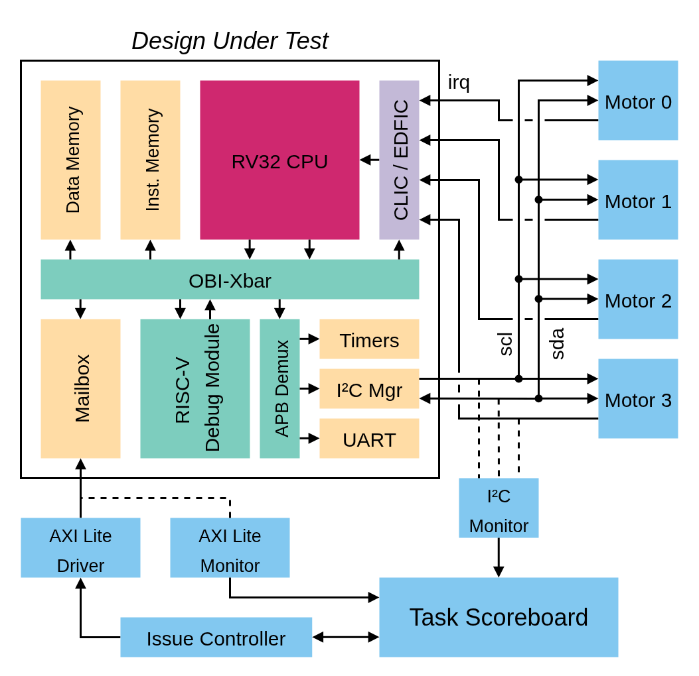

# zeroHETI Control Simulation Demonstrator

## Abstract

This demonstrator simulates the operation of zeroHETI in cyber-physical control system with hard real-time constraints and as part of a larger System-on-Chip (SoC). The demonstrator is created primarily as a testbed for evaluation and comparison of the [`edfic`](https://github.com/ANurmi/edfic/tree/main) against the PULP Platform core-local interrupt controller ([`pulp-clic`](https://github.com/pulp-platform/clic/releases/tag/v2.0.0)) in a representative in-system simulation.

## Prerequisites


- [Bender](https://github.com/pulp-platform/bender) – Dependency manager, tested on 0.29.1

- [Verilator](https://github.com/verilator/verilator) – Cycle-accurate RTL simulator, tested on 5.042 
- [Cargo](https://doc.rust-lang.org/cargo/) – Rust build system.
- [RISC-V GNU Toolchain](https://github.com/riscv-collab/riscv-gnu-toolchain) – `riscv32-unknown-elf-gcc` binary required for linking object files.

## System Description

The simulation environment models a system where the zeroHETI Design Under Test (DUT) communicates with on-chip entities (e.g., application processors, accelerators) and applies high-level control directives to four peripheral-controlled motor models. This setup can be scaled in complexity and aims to be representative of a medium-complexity cyber-physical hard real-time system.


The simulated system is illustrated in the following figure. Specifically, the DUT interfaces with the simulation environment via
- A bi-directional hardware mailbox, accessible externally through an AXI Lite Subordinate interface.
- An I²C controller peripheral driving a common bus.
- A set of interrupt inputs (irq).



### Task Scoreboard
The core of the simulation environment is the task scoreboard. The scoreboard dynamically updates a timing model of the system tasks and monitors their progression. If the scoreboard observes that a task is activated but does not complete within its specified deadline, a runtime error is raised and the simulation is terminated. The scoreboard logs the occurrence of tasks, their worst (i.e., smallest) completion slack, and average completion slack. These statistics are printed per-task at the end of the simulation.

### Issue Controller
The issue controller emulates the functionality of a co-operative on-chip application processor by receiving status messages from and sending control directives to the DUT. TODO: parameter for issue frequency

### Motor Models
TODO: rework & document


### Hardware Mailbox
The mailbox implements an inbox and and outbox queue for messages (letters). Letters consist of an address and data, which the receiver may interpret arbitrarily. The inbox and outbox are logically labeled from the perspective of the DUT, i.e., the DUT sends letters to the outbox and receives letters from the inbox.

### Mailbox Memory Map

|Name           |Description                       |Access            | Address     |
|---------------|----------------------------------|------------------|-------------|
|`MBX_STAT    ` | General status register          | OBI (R), AXI (R) | 0x0003_0000 |
|`MBX_OBI_CTRL` | zeroHETI-facing control register | OBI (RW)         | 0x0003_0004 |
|`MBX_AXI_CTRL` | SoC-facing control register      | AXI (RW)         | 0x0003_0008 |
|`MBX_IADD    ` | Inbox letter address             | AXI (W), OBI (R) | 0x0003_000C |
|`MBX_IDAT    ` | Inbox letter data                | AXI (W), OBI (R) | 0x0003_0010 |
|`MBX_OADD    ` | Outbox letter address            | AXI (R), OBI (W) | 0x0003_0014 |
|`MBX_ODAT    ` | Outbox letter data               | AXI (R), OBI (W) | 0x0003_0018 |

### Mailbox Bitfields 
- `MBX_STAT`:
    - `[3]`: Outbox full
    - `[2]`: Outbox empty
    - `[1]`: Inbox full
    - `[0]`: Inbox empty

- `MBX_OBI_CTRL`:
    - `[24]`: Inbox read acknowledge
    - `[17]`: Interrupt clear 
    - `[16]`: Interrupt set 
    - `[9]`: Flush outbox
    - `[8]`: Flush inbox
    - `[0]`: Outbox letter send


- `MBX_AXI_CTRL`:
    - `[2]`: Interrupt set
    - `[1]`: Inbox letter send
    - `[0]`: Outbox read acknowledge

### TODO: Task Set Description

### Parameters

For Rust-based builds parameters can be passed to the simulation by prefixing the appropriate environment variables to the Cargo-call, e.g.:
```
RUNTIME_MS=2 cargo run --release -Frtl-tb -Fintc-clic --example control_sim
```
NOTE/TODO: add separate `sim-params.env` or equivalent to make this more scalable. 

Parameters passable through environment variables are:
- `RUNTIME_MS`: The runtime of the measured part of the application in milliseconds.
- ``


TODO: Zephyr

## Experimental Workflow

The simulation parameters are written to the following addresses from the application software via mailbox messages:

TODO: define
|Name           |Description                       | Address     |
|---------------|----------------------------------|-------------|
|`SIM_PARAM_O ` |                                  | 0x0100_0000 |
|`SIM_PARAM_1 ` |                                  | 0x0200_0000 |
|`SIM_PARAM_2 ` |                                  | 0x0300_0000 |
|`SIM_PARAM_3 ` |                                  | 0x0400_0000 |


Parameters are passed at runtime to limit the need for (relatively slow) Verilator hardware recompilation between simulation runs.

After the simulation parameters are programmed, an arbitrary write to the `SIM_START` (TODO:define) address starts the main simulation loop. Respectively, a write to `SIM_END` terminates the simulation loop and invokes the task statistics printout. 

## Measured Results

- Final report format: total duration, CPU utilization, instruction count, task statistics